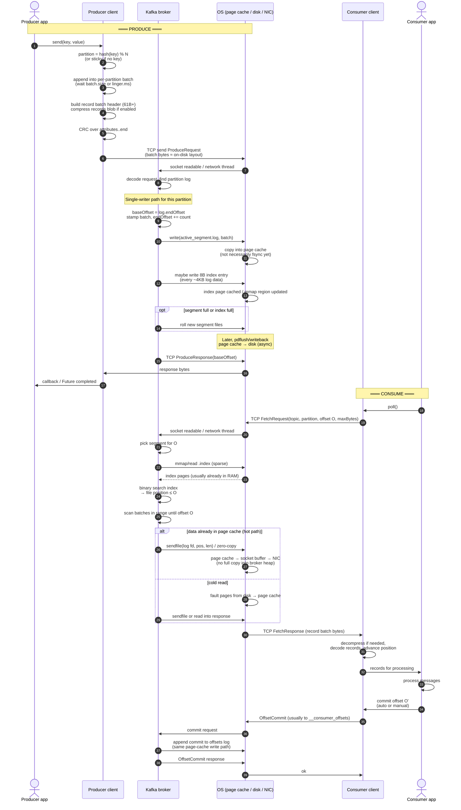

# Kafka Internals: Design, Flow, Optimizations

---

## 1. Core model

```text
Topic  →  logical stream name
  └── Partition  →  ordered log (the real unit of scale + order)
        └── Segments  →  fixed-size chunks of that log on disk
```

- **Ordering** is guaranteed only **inside a partition**.
- **Throughput** scales by adding partitions (and brokers to host them).
- A partition is an **append-only** sequence of messages, each with a monotonic **offset** (0, 1, 2, …).

Think: each partition is a commit log on disk, not a database table.

---

## 2. On-disk layout

Partitions live as directories. Each is split into **segments** so one file never grows forever.

```text
log.dirs/
  orders-0/
    00000000000000000000.log
    00000000000000000000.index
    00000000000000000000.timeindex
    00000000000000045221.log      ← active segment (only this is appended)
    00000000000000045221.index
    00000000000000045221.timeindex
  orders-1/
    ...
```

| File | Role |
| --- | --- |
| `.log` | Raw record batches, sequential bytes |
| `.index` | Sparse: offset → byte position in `.log` |
| `.timeindex` | Sparse: timestamp → offset |

Segment filename = **base offset** of the first message in that segment.

**Roll** to a new segment when size hits `log.segment.bytes` (default ~1 GB) or max age. Old segments are immutable → easy to delete for retention, easy to map into memory for reads.

---

## 3. Message layout (sizes)

Kafka does not write one isolated message as the durable unit. Producers send **record batches** (Magic v2). On-disk layout ≈ wire layout.

### Record batch header — fixed **61 bytes** before the records blob

| Field | Size | Notes |
| --- | ---: | --- |
| Base offset | 8 | Absolute offset of first record (broker stamps on append) |
| Batch length | 4 | Bytes after this field through end of batch |
| Partition leader epoch | 4 | Leader generation |
| Magic | 1 | `2` for current format |
| CRC | 4 | CRC-32C from attributes through end of batch |
| Attributes | 2 | Codec (gzip/snappy/lz4/zstd), timestamp type, transactional flags |
| Last offset delta | 4 | `last_offset - base_offset` |
| First timestamp | 8 | ms |
| Max timestamp | 8 | ms |
| Producer id | 8 | Idempotent/txn (0 if unused) |
| Producer epoch | 2 | |
| Base sequence | 4 | |
| Records count | 4 | Number of records in this batch |
| **Header total** | **61** | Then: records array (maybe compressed) |

```text
| baseOffset 8 | length 4 | epoch 4 | magic 1 | crc 4 | attrs 2 |
| lastDelta 4 | firstTs 8 | maxTs 8 | pid 8 | pEpoch 2 | baseSeq 4 | count 4 |
| records... (compressed or plain)                                          |
```

If compression is enabled, only the **records array** is compressed; the 61-byte header stays plain so the broker can read offsets/CRC without decompressing for every bookkeeping step.

### Single record (variable size; varints)

Sizes below are **minimums** when varints encode small numbers (1 byte each). Large deltas/lengths expand to 2–5 bytes (varint) or 2–10 (varlong).

| Field | Size | Notes |
| --- | ---: | --- |
| Length | 1–5 (varint) | Size of the rest of this record |
| Attributes | 1 | Currently unused flags |
| Timestamp delta | 1–10 (varlong) | Relative to batch first timestamp |
| Offset delta | 1–5 (varint) | Relative to batch base offset |
| Key length | 1–5 (varint) | `-1` → null key |
| Key | N | Application bytes |
| Value length | 1–5 (varint) | `-1` → null value |
| Value | M | Application bytes |
| Headers count | 1–5 (varint) | |
| Per header | varint key len + key + varint val len + val | Optional metadata |

**Example (no headers, tiny deltas):** null key, 100-byte value ≈  
`1 + 1 + 1 + 1 + 1 + 0 + 1 + 100 + 1` ≈ **107 bytes** record body, plus batch header amortized across the batch.

### Index entry sizes

| File | Entry layout | Entry size |
| --- | --- | ---: |
| `.index` | relative offset (4) + file position (4) | **8 bytes** |
| `.timeindex` | timestamp (8) + relative offset (4) | **12 bytes** |

Sparse: one index entry about every `log.index.interval.bytes` (default **4096**) of log data — not per message.

**Broker assigns absolute offsets** when the batch is appended. After that, disk bytes are what fetch returns.

---

## 4. Indexes (seeking without scanning the world)

The `.log` is variable-length. You cannot jump to “offset 1_000_000” with arithmetic alone. Indexes fix that.

### Offset index (`.index`)

**Sparse**, not one entry per message. Roughly one entry every `log.index.interval.bytes` (default 4 KB of log data).

```text
.index                              .log
rel_offset → position               position → record batches
   0       → 0          ─────────►  [batch offsets 1000..]
  46       → 4096       ─────────►  [batch offsets 1046..]
```

Entries store **relative** offset (`absolute - segment_base`) and file position (**8 bytes** per entry; see §3).

**Lookup offset T:**

1. Find the segment whose range contains `T`.
2. Binary search the index for largest entry ≤ `T`.
3. Seek to that byte in `.log`, scan forward until you hit `T`.

Scan distance is bounded by the index interval + batch size — cheap.

### Time index (`.timeindex`)

`timestamp → offset`, same sparse idea.

Path for “start from 8:00”:

1. Binary search `.timeindex` → offset  
2. Offset index → file position  
3. Scan `.log`

### mmap

Index files are **memory-mapped** (`mmap`). Binary search runs over memory, not `read()` syscalls per probe. Indexes stay small (sparse), so mapping them is realistic; mapping entire multi-GB logs is not the design.

---

## 5. Performance design (why it’s fast)

### Append-only sequential I/O

Every write is append to the **active segment**. Disks (HDD and SSD) love sequential patterns. No B-tree page splits, no random in-place updates for the common path.

### OS page cache, not a huge JVM buffer pool

Kafka writes/reads through the normal filesystem:

```text
write(batch) → OS page cache → (later) disk
read/fetch   → OS page cache  (hot data never touches disk)
```

Consequences:

- Less object churn on the JVM heap → less GC.
- Free RAM becomes cache automatically.
- After broker process restart, **page cache can still be warm**.

Ops rule of thumb: keep the JVM heap modest so the OS still has RAM for cache.

### Zero-copy fetch (`sendfile`)

Naive path copies data too many times:

```text
disk → kernel → user-space buffer → socket buffer → NIC (network interface card buffer)
```

Because disk format ≈ network format, Kafka can do:

```text
disk → page cache ── sendfile system call ──► NIC / socket
```

Payload never needs a full copy into broker user-space for the hot path (TLS breaks pure zero-copy; plaintext benefits most).

### Batching

Producers group records into batches per partition before send. That amortizes:

- syscalls  
- network frames  
- per-batch CRC / compression  
- broker append work  

Latency vs throughput is mostly a producer `linger.ms` / `batch.size` knob.

---

## 6. Write path (produce)

### Step A — producer picks a partition

| Case | Behavior |
| --- | --- |
| Record has a **key** | `hash(key) % num_partitions` → same key always same partition → order per key |
| No key | Sticky partitioner: fill batches on one partition, then switch — better batching than pure round-robin |

Partition choice is a **client** decision (using metadata: topic → partition count → leader addresses).

### Step B — producer accumulates a batch

Per partition, the client buffer:

1. Accepts `send()` calls (async API).
2. Packs records into a batch until `batch.size` or `linger.ms`.
3. Optionally compresses the batch.
4. Sends `Produce` over TCP to the **leader** of that partition.

Retries, timeouts, `acks` are client config; they change when the client considers a write “done,” not the on-disk format.

### Step C — broker append (single writer per partition)

Critical design:

> **One partition log has one writer path.** Multiple producers still serialize at the leader’s append for that partition.

Rough flow on the leader:

```text
Network thread receives Produce
        ↓
Request handed to handler / I/O path
        ↓
For that partition’s log (serialized append):
  • next_offset = log.end_offset
  • stamp batch with base offset
  • append bytes to active segment  (page cache)
  • maybe add sparse index entries
  • end_offset += record_count
        ↓
Respond with base offset (depending on acks)
```

Why single-threaded (per partition log):

- Offset assignment is a simple counter — no lock storm, no dual-writer races.
- Append order = offset order = the ordering guarantee.
- Concurrency comes from **many partitions**, not many writers on one log.

Broker-wide threading is still multi-threaded (network + request handlers). The invariant is **per-partition append serialization**, not “entire broker is one thread.”

### Step D — durability knobs (producer view)

| `acks` | Meaning (simplified) |
| --- | --- |
| `0` | Don’t wait for broker |
| `1` | Leader has appended (usually to page cache) |
| `all` | Leader waits for configured replica sync (cluster durability; skip deep replica mechanics here) |

Kafka typically does **not** `fsync` every message. Throughput assumes sequential write + page cache (+ replicas in real clusters).

---

## 7. Read path (consume)

### Consumer model

- Consumer tracks a **cursor**: next offset per partition.
- Pull-based: consumer sends `Fetch(topic, partition, offset, max_bytes)`.
- Broker does **not** push and does **not** delete on read. Retention is independent of consumers.

### Fetch on the broker

```text
Fetch(offset = O)
  → pick segment for O
  → sparse index binary search → file position
  → read a byte range of batches (prefer page cache / sendfile)
  → return batches to consumer
```

Consumer deserializes keys/values, processes, then advances its offset.

### Committing offsets

“How far did I process?” is separate from the data log:

- Usually committed to the internal `__consumer_offsets` topic (or another store).
- Commit frequency = tradeoff between duplicate processing after crash vs loss of progress.

At-least-once default mental model: process → commit. Crash before commit → re-read → possible duplicates. Exactly-once is a bigger story; not required to understand the log.

### Consumer groups (flow only)

```text
Several consumers, one group.id
  → group coordinator assigns partitions across members
  → each partition owned by at most one member in the group
  → rebalance when members join/leave
```

Design intent: **scale consumption** by adding consumers up to the partition count. More consumers than partitions → idle members.

---

## 8. Sequence: Producer ↔ Kafka ↔ OS ↔ Consumer

Detailed path for one produce then one consume. Actors: **Producer**, **Kafka broker**, **OS** (page cache + disk + network stack), **Consumer**.



---

## 9. Design checklist (the important ideas)

| Idea | What it buys you |
| --- | --- |
| Partitioned logs | Parallelism + per-key order |
| Append-only segments | Sequential disk, simple retention (drop files) |
| Sparse offset/time indexes + mmap | Fast seek, small index footprint |
| Batch as unit | Compression, fewer syscalls, wire=storage shape |
| Single writer per partition | Trivial offset assignment + hard ordering |
| Page cache | Huge cache without JVM pain |
| Zero-copy fetch | Cheap fanout reads |
| Pull consumer + explicit offsets | Many independent readers, replay history |
| Consumer group assignment | Scale out processing |